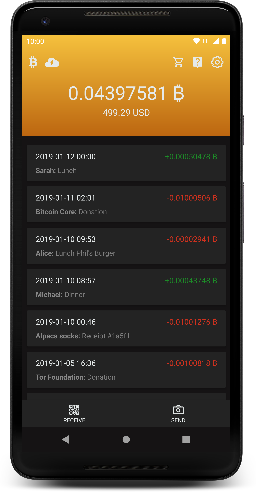

# Blixt Lightning Wallet

Blixt Wallet is an open source Lightning Bitcoin Wallet for Android with focus on usability and user experience,
powered by lnd and Neutrino SPV.

  

## Features

- [x] Embedded lnd with Neutrino
- [x] Descriptive and clean transaction log
- [x] Receive payments
- [x] Autopilot
- [x] Pincode
- [x] Fingerprint
- [x] Optional Recipient/Sender name that will be displayed on transactions
- [x] Optional "Payer" field for bookkeeping when creating invoice
- [x] Scheduled sync of chain background job
- [x] Local channel backup
- [x] [LNURL](https://github.com/btcontract/lnurl-rfc) support (all sub-protocols: pay, channel, auth and withdraw)
- [x] Channel backup to Google Drive (Android) and iCloud (iOS)
- [x] [WebLN](https://webln.dev/) browser
- [x] Support for [Multi-Part Payments (MPP)](https://lightning.engineering/posts/2020-05-07-mpp/)
- [x] Integrated Tor support
- [ ] NFC
- [ ] WatchTower
- [ ] URL Payments
- [ ] Pay to Username

## Build Steps

Blixt targets three platforms right now: Web, Android and iOS.

The web target is only used for prototyping and is not a real wallet.

### Web

The easiest way to build Blixt is to build the web version, because you only need Node+Yarn installed and you don't have to compile lnd as you would have for the native targets.

The web version is not used as a real wallet and is only used for fast prototyping.
It's useful if you want to make design and GUI changes.

- Install [Node](https://nodejs.org) and [Yarn](https://classic.yarnpkg.com/)
- Install Node packages: `yarn`
- Generate proto files: `yarn gen-proto`
- Start the web server: `yarn web`

### Android

- Install [Node](https://nodejs.org), [Yarn](https://classic.yarnpkg.com/) and [Android Studio + Android SDK (including NDK)](https://developer.android.com/studio/)
- If needed, install an emulated android device inside Android Studio
- Download lnd binary from [blixt-lndmobile-releases](https://github.com/BlixtWallet/blixt-lndmobile-releases/releases) and put it in `android/lndmobile`. Alternatively build lnd for Android by following the steps in [build-android-aar.md](build-android-aar.md)
- Get the tor sub-module: `git submodule update --init`
- Install Node packages: `yarn`
- Compile the Tor Android lib: `yarn build-tor-lib`
- Generate proto files: `yarn gen-proto`

To start the application:
- Run: `yarn start-metro`
- Run: `yarn android:mainnet-debug` or `yarn android:testnet-debug`

### iOS

_The iPhone/iOS version is still work in progress._

To build the iOS version, macOS is required. You also need an Apple Developer account, although you do not need to be enrolled in the Developer Program.

- Install [XCode](https://developer.apple.com/xcode/), [Node](https://nodejs.org) and [Yarn](https://classic.yarnpkg.com/)
- Build lnd for iOS by following the steps in [build-ios-framework.md](build-ios-framework.md)
- Install Node packages: `yarn`
- Generate proto files: `yarn gen-proto`
- Install CocoaPods libs: `cd ios && pod install`
- Setup team signing:
  - Open ios/BlixtWallet/BlixtWallet.xcworkspace with XCode
  - Login with your Apple Developer account if XCode asks you to
  - Click on BlixtWallet in the left column
  - Click on the Signing &amp; Capabilities tab
  - Choose your Team in the dropdown and choose a new unique Bundle Identifier (cannot be the same as the ones released on the App Store). Do this for every configuration

To start the application:
- Run: `yarn start-metro`
- Run: `yarn ios:mainnet-debug --device "<your device name>"` or build from XCode

## Commit and Code-Style

Follow the code style of the file you are working in.
For commits, make descriptive and atomic git commits.

## License

MIT
