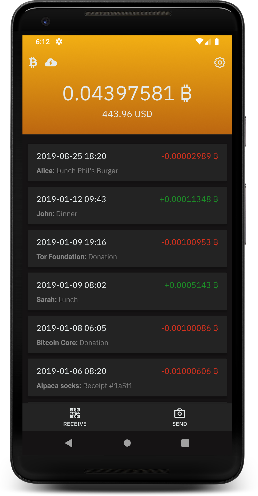

# Blixt Lightning Wallet!

Blixt Wallet is an open source Lightning first Bitcoin Wallet for Android with focus on usability and user experience,
powered by lnd and Neutrino SPV.

  

# Features
* [x] Embedded lnd with Neutrino
* [x] Descriptive and clean transaction log
* [x] Receive payments
* [x] Autopilot
* [x] Pincode
* [x] Fingerprint
* [x] Optional Name that will be displayed on invoices
* [x] Optional "Payer" field for bookkeping when creating invoice
* [ ] WebLN support
* [ ] Backup to Google Drive
* [ ] Scheduled sync of chain
* [ ] Watchtower
* [ ] URL payments

## Build steps
* Install Go, Node, Yarn, react-native CLI, Android Studio and Android SDK (using npm instead of yarn might work)
* If needed, install an emulated android device inside Android Studio
* Build lnd for Android by following the steps in [build-android-aar.md](build-android-aar.md)
* Install Node packages: `yarn`
* Generate proto files: `yarn gen-proto`
* Run: `yarn testnet-debug` (make sure you either have an Android emulator running or an Android device connected via USB)

## Commit and code-style
Follow the code style of the file you are working in.
For commits, make descriptive and atomic git commits.

## License
MIT
